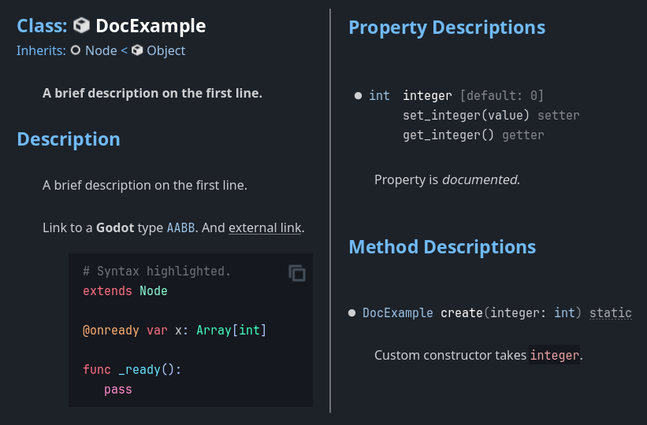

+++
# Copyright (c) godot-rust; Bromeon and contributors.
# This Source Code Form is subject to the terms of the Mozilla Public
# License, v. 2.0. If a copy of the MPL was not distributed with this
# file, You can obtain one at https://mozilla.org/MPL/2.0/.

title = "November 2024 dev update"
authors = ["Bromeon"]

[extra]
summary = "v0.2 release, ergonomic arguments, RPC methods, node init, ..."
tags = ["dev-update"]
+++

Things have been slightly calmer in the last few months, yet a lot has happened behind the scenes!

This post announces the next big iteration of godot-rust, version **0.2**. We are excited to share what this release brings to the table.


## Ergonomic + fast argument passing

In version 0.1, all Godot engine APIs took their arguments by value, with a concrete parameter type. This approach has notable drawbacks:

1. It often requires conversions because your argument type doesn't match the declared parameter exactly.
   - Passing strings as `"string".into()` has become its own idiom.
   - If a method accepts `Gd<Node>` but you have a `Gd<Node2D>`, you'll need to call `node.upcast()`.

2. If you want to keep using your (non-`Copy`) argument after the call, you _must_ use `.clone()` all the time.
   - It makes code repetitive and attracts unneeded attention. In Rust, `clone()` is not _that_ common for passing arguments.
   - Creating such a clone army has a performance cost for reference-counted types (`Gd<RefCounted>`, `GString`, `Array`, ...). If Godot takes ownership of a value (e.g. storing a string), it already clones internally, so you pay twice.


### Powerful conversions

In version 0.2, we introduce a streamlined API for argument passing. Affecting the core type machinery, this took a ludicrous amount of time to implement, but is (hopefully...) worth the results:

1. **Pass by reference.**

   All container types such as `Gd`, `Array`, `Dictionary`, `GString`, `Callable`, `Variant`, `PackedInt32Array` are now passed by reference. This means you get rid of an unnecessary clone, you can keep using the value after the call, and your call-site code is often reduced to a single `&` borrow.

   Types which implement `Copy`, such as `i32`, `bool`, `Vector3`, `Color` etc. are still passed by value.

2. **Automatic upcasting.**

   If a parameter expects an object parameter of class `T`, you can now not only pass `T` objects, but instances of all classes that inherit from `T`. You no longer need a manual `.upcast()` call, the library takes care of this, completely type-safe.  
   Rust is clearly a very OOP language.

3. **Implicit string conversions.**

   Rust is following the "make things explicit" idea in a hardcore way, and in many cases this prevents errors and makes code easier to read. But there are situations where this results in verbosity before anything else, becoming a burden on your code -- especially in game development where fast prototyping matters.

    `"some_string".into()` is a good example of this. After certain time, you'll _know_ that Godot has its own string types different from Rust `&str`, so the fact that a conversion is happening is no longer providing you valuable information -- at least not to the point where you want to be reminded of it in every 2nd line of code.

     This is why you can now pass `&str` strings as `"some_string"` literals directly. If you have `String` instances, just borrow them with `&my_string`.


### Talk is cheap, show me the code

These are real code samples from the library's integration tests and the dodge-the-creeps demo.
Get your own impression of the before/after:

```rust
// BEFORE: strings always converted with .into().
message_label.set_text("Dodge the\nCreeps!".into());
let val: Array<GString> = array!["Godot".into(), "Rust".into(), "Rocks".into()];

// AFTER: strings can be passed directly, even in array literals.
message_label.set_text("Dodge the\nCreeps!");
let val: Array<GString> = array!["Godot", "Rust", "Rocks"];
```

```rust
// BEFORE: test code needs to clone arg on each call.
let changes = StringName::from("property_changes");
assert!(!revert.property_can_revert(changes.clone()));
assert!(revert.property_can_revert(changes.clone()));
assert_eq!(revert.property_get_revert(changes.clone()), Variant::nil());

// AFTER: just borrow it.
let changes = StringName::from("property_changes");
assert!(!revert.property_can_revert(&changes));
assert!(revert.property_can_revert(&changes));
assert_eq!(revert.property_get_revert(&changes), Variant::nil());
```

```rust
// BEFORE: not only cloning, but upcasting.
self.base_mut().add_child(mob_scene.clone().upcast());

// AFTER: auto-upcast, no clone.
self.base_mut().add_child(&mob_scene);
```

These changes have been implemented in a marathon of PRs (where an addition typically required 3 follow-up PRs to fix the fallout):
- Object parameters: [#800], [#823], [#830], [#846]
- Pass-by-ref: [#900], [#906], [#947], [#948]
- String conversions: [#940]  
  <sup>(no follow-up here is admittedly suspicious...)</sup>

[#800]: https://github.com/godot-rust/gdext/pull/800
[#823]: https://github.com/godot-rust/gdext/pull/823
[#830]: https://github.com/godot-rust/gdext/pull/830
[#846]: https://github.com/godot-rust/gdext/pull/846
[#900]: https://github.com/godot-rust/gdext/pull/900
[#906]: https://github.com/godot-rust/gdext/pull/906
[#940]: https://github.com/godot-rust/gdext/pull/940
[#947]: https://github.com/godot-rust/gdext/pull/947
[#948]: https://github.com/godot-rust/gdext/pull/948


## Path-based node initialization

In [#807], Houtamelo added a great feature: initialization for nodes based on a path. This was achieved by wiring up `OnReady<T>` with custom init logic, exposed through a new `#[init(node)]` attribute.

The following code directly initializes fields with the nodes found at the given path:
```rust
#[derive(GodotClass)]
#[class(init, base=Node3D)]
struct Main {
    base: Base<Node3D>,

    #[init(node = "Camera3D")]
    camera: OnReady<Gd<Camera3D>>,

    #[init(node = "Hud/CoinLabel")]
    coin_label: OnReady<Gd<Label>>,
}
```

In case you don't know [`OnReady`][api-onready], it provides a late-init mechanism with ergonomic access, i.e. no constant `.unwrap()` or defensive if-initialized checks. You can access `OnReady<Gd<Node>>` as if it were a `Gd<Node>`:
    
```rust
self.coin_label.set_text(&format!("{} coins", self.coins));
```

[#807]: https://github.com/godot-rust/gdext/pull/807


## Generating Godot docs from RustDoc

[#748] is a pull request from bend-n, which adds another great feature: the ability to register documentation alongside Rust classes and methods. If you enable the `register-docs` crate feature, you can use regular RustDoc comments, which will be picked up by the editor.

Let's say you have the following Rust code. It registers a class with a property and a function, all of which are documented:


```rust
/// A brief description on the first line.
///
/// Link to a **Godot** type [AABB].
/// And [external link](https://godot-rust.github.io).
///
/// ```gdscript
/// # Syntax highlighted.
/// extends Node
///
/// @onready var x: Array[int]
///
/// func _ready():
///    pass
/// ```
#[derive(GodotClass)]
#[class(init, base=Node)]
struct DocExample {
    /// Property is _documented_.
    #[export]
    integer: i32,
}

#[godot_api]
impl DocExample {
    /// Custom constructor takes `integer`.
    #[func]
    fn create(integer: i32) -> Gd<Self> {
        Gd::from_object(DocExample { integer })
    }
}
```

This will render as follows in the editor:



This even works with editor hot-reloads (although you need to reopen the doc tab).
Not all Markdown elements are supported yet, but this will improve over time. Contributions are of course welcome!

[#748]: https://github.com/godot-rust/gdext/pull/748

## `#[rpc]` attribute

Houtamelo also helped build [#902], a PR which adds an `#[rpc]` attribute to user-defined functions. This brings the [GDScript `@rpc`][gdscript-rpc] feature to Rust, allowing you to configure remote procedure calls in your Rust scripts.

Example usage:
```rust
#[rpc(any_peer, reliable, call_remote, channel = 3)]
fn my_rpc(&self, i: i32, s: String) -> Variant {
   ...
}
```
You can also define a global RPC configuration and reuse it for multiple functions:
```rust
const CONFIG: RpcConfig = RpcConfig {
    rpc_mode: RpcMode::AUTHORITY,
    transfer_mode: TransferMode::RELIABLE,
    call_local: false,
    channel: 1,
};
```

[#902]: https://github.com/godot-rust/gdext/pull/902


## QoL features

Lots of little things have been added to make your life easier. Here are some highlights related to enums:

```rust
// Bitmask support for known enum combinations.
let shifted_key = Key::A | KeyModifierMask::SHIFT;

// String conversions.
let b: BlendMode = BlendMode::MIX;
let s: &str = b.as_str(); // "MIX"

// Complex ordinals.
#[derive(GodotConvert)]
#[godot(via = i64)]
enum SomeEnum {
   A = (1 + 2), // Use non-literal expressions.
   B,
   C = (AnotherEnum::B as isize), // Refer to other constants.
}
```

**Panics** have become much more helpful, thanks to 0x53A adding source locations to error messages ([#926]).

Library usage is now more robust due to various validations:
- `#[class(tool)]` is required for classes that need an editor context ([#852]).
- `Array<i8>` etc. now verify that elements are in range ([#853]).
- Disallow `Export` if class doesn't inherit `Node` or `Resource` ([#839]).
- Disallow `Export` for `Node`s if the base class isn't also `Node` ([#841]).

[#839]: https://github.com/godot-rust/gdext/pull/839
[#841]: https://github.com/godot-rust/gdext/pull/841
[#852]: https://github.com/godot-rust/gdext/pull/852
[#853]: https://github.com/godot-rust/gdext/pull/853
[#926]: https://github.com/godot-rust/gdext/pull/926


## Performance

Interactions with Godot have been boosted quite a bit, in particular:

- Pass-by-ref alleviating ref-counting operations which use thread synchronization.
- Cached internal object pointers ([#831]), no longer fetching it through Godot's object database.
- Complete rewrite of `ClassName`, using global backing memory with interned class strings ([#834]).
- Removed panic hooks in Release mode ([#889]).

Many thanks to Ughuu for driving multiple improvements and providing detailed benchmarks. 

[#831]: https://github.com/godot-rust/gdext/pull/831 
[#834]: https://github.com/godot-rust/gdext/pull/834
[#889]: https://github.com/godot-rust/gdext/pull/889


## Conclusion

This release is a big step forward when it comes to UX and interacting with Godot APIs. At the same time, v0.2 also lays the groundwork for many future additions.

A ton of features, bugfixes and tooling enhancements haven't been covered in this post. This time, our [changelog] was so big that subsections were necessary to keep an overview. Check it out!

If you have existing 0.1 code and feel overwhelmed, there is a [migration guide][migrate-v0.2] to help you out.


[api-onready]: https://godot-rust.github.io/docs/gdext/master/godot/obj/struct.OnReady.html
[changelog]: https://github.com/godot-rust/gdext/blob/master/Changelog.md#v020
[gdscript-rpc]: https://docs.godotengine.org/en/stable/tutorials/networking/high_level_multiplayer.html#remote-procedure-calls
[migrate-v0.2]: https://godot-rust.github.io/book/migrate/v0.2.html
